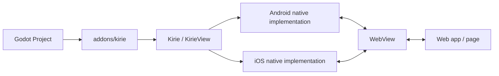

# godot-kirie

Kirie is an experimental Godot plugin project for embedding platform WebViews and
building IPC between Godot and web content.

## Current Architecture

The repository is still deliberately small, but it now has distinct package,
example, and regression-test areas:

- `packages/kirie`: the Godot addon plus Android and iOS native plugin code
- `packages/ipc`: a thin browser-side transport wrapper for Kirie WebView pages
- `examples/basic-ipc`: the first runnable manual integration example
- `tests/integration`: exported-app platform integration tests
- `scripts`: local build and run helpers for native validation
- `docs`: project notes and design decisions
  - `docs/dreams`: exploratory notes for ideas outside the current milestone

Primary references live in [docs/references.md](docs/references.md).

The first milestone is limited to:

1. Create a WebView on mobile platforms.
2. Establish bidirectional IPC between Godot and the WebView.
3. Support packaged `res://` web content loading for bridge tests.
4. Stabilize the minimum Kirie plugin shape before adding adapters and tooling.

At this stage, Kirie is intended to stay a low-level WebView and IPC bridge. A
small `@gd-kirie/ipc` browser package exists as a convenience transport wrapper,
but higher-level application semantics are still deferred to future layers such
as adapters above Kirie.
