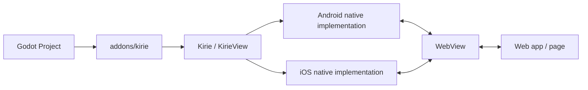

# godot-kirie

Kirie is an experimental Godot plugin project for embedding platform WebViews and
building IPC between Godot and web content.

## Current Architecture

The repository starts with a deliberately small structure:

- `packages/kirie`: the plugin package itself
- `examples/basic-ipc`: the first integration example
- `docs`: project notes and design decisions

Primary references live in [docs/references.md](docs/references.md).

The first milestone is limited to:

1. Create a WebView on mobile platforms.
2. Establish bidirectional IPC between Godot and the WebView.
3. Stabilize the minimum Kirie plugin shape before adding adapters and tooling.

At this stage, Kirie is intended to stay a low-level WebView and IPC bridge.
Higher-level semantics are intentionally deferred to future layers such as an
`eventa` adapter or a small browser-facing `KirieIpcBridge` SDK.
